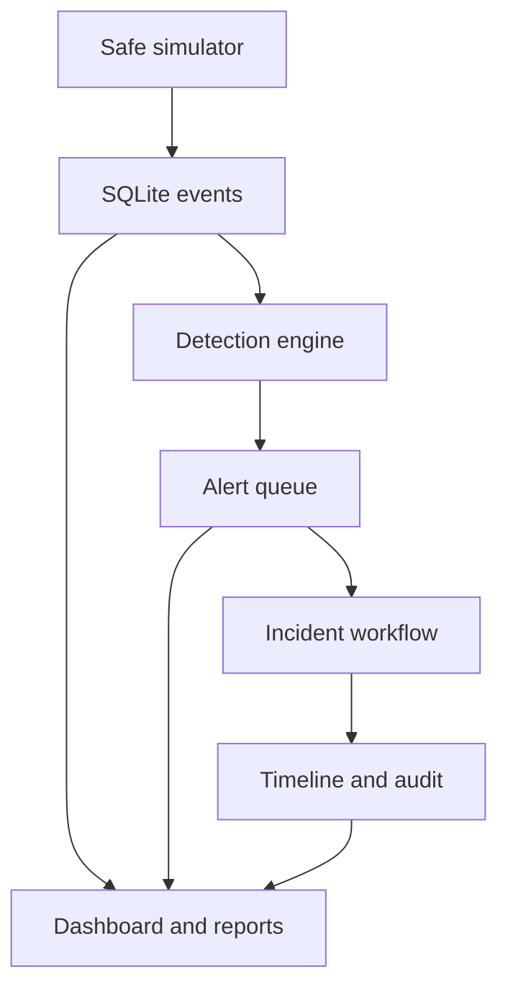
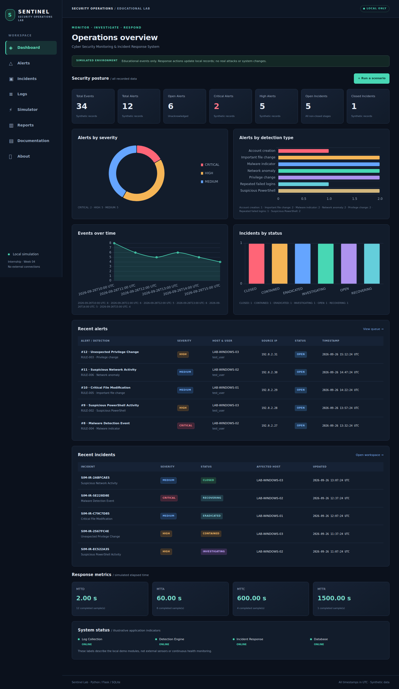
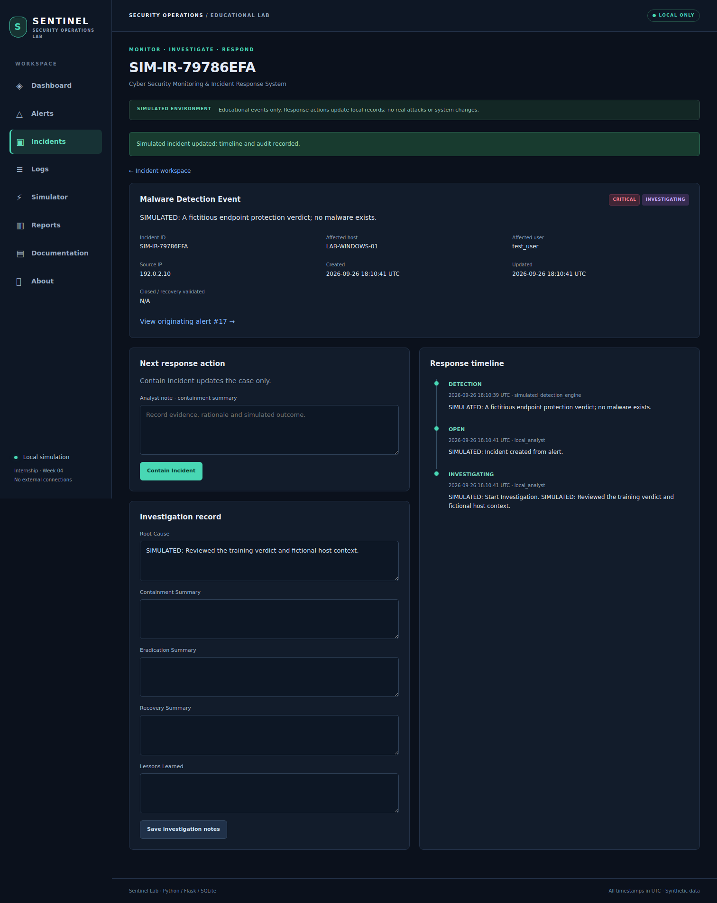

# Cyber Security Monitoring & Incident Response System

**Sentinel Lab · Week 4 cybersecurity internship project**

A local, educational Security Operations Center (SOC) simulation built with Python, Flask, SQLite and Chart.js. Generate safe synthetic security events, inspect rule-based alerts, investigate incidents through a recorded response lifecycle, and export exercise metrics—all without attacking or connecting to external systems.

> SIMULATED EDUCATIONAL ENVIRONMENT. This is not a real SIEM or production security tool. No malware, exploitation, credential collection, external scanning, or operating-system response actions are implemented.

## Overview and objectives

Practice log normalization, detection, alert triage, severity-based escalation, incident investigation, containment, eradication, recovery validation and lessons learned. Learn how timing measurements and analyst evidence support a response process.

## Quick start (Windows / VS Code)

1. Extract the ZIP. Open the inner `cyber-security-monitoring-ir` folder in VS Code.
2. Choose **Terminal → New Terminal** and run:

```powershell
python -m venv .venv
.\.venv\Scripts\python.exe -m pip install -r requirements.txt
.\.venv\Scripts\python.exe app.py
```

3. Open **http://127.0.0.1:5000** in your browser. Keep the terminal running. Stop with **Ctrl+C**.

These commands do not require PowerShell script activation or an execution-policy change. If `python` is unavailable, install Python 3.11+ and enable its PATH option, or use the Windows `py` launcher.

### Standard virtual-environment workflow

Windows PowerShell (optional activation):

```powershell
.\.venv\Scripts\Activate.ps1
python -m pip install -r requirements.txt
python app.py
```

If activation is blocked, use the direct interpreter commands above.

macOS / Linux:

```bash
python3 -m venv .venv
source .venv/bin/activate
python -m pip install -r requirements.txt
python app.py
```

After dependencies are installed, the app runs locally without internet. Chart.js is bundled, not loaded from a CDN. Initial Python/pip installation normally requires internet; no cloud account is needed. Runtime requires only Flask and its dependencies; pytest is for testing.

## First launch and sample data

SQLite schema and synthetic demo data initialize automatically. A fresh database contains **34 events, 12 alerts and 6 incidents** across all six incident statuses. Every event description and raw record identifies simulated data. Historical timestamps intentionally illustrate completed response stages; they are not real measurements of security effectiveness.

Subsequent launches reuse the database without duplicating seed data. To reset only the exercise records: stop the app, delete `database/soc.db`, then restart. This removes all local demo records and analyst notes; back up the file first if needed. Database files are not included in the ZIP or GitHub source.

## Demonstration in five minutes

1. Open Dashboard and explain the four charts and seven counters.
2. Open Simulator → Generate Brute Force. Inspect its generated alert in Alerts.
3. Acknowledge the alert. Click Create incident (repeated clicks reuse the same case).
4. Add a note, then Start Investigation → Contain Incident → Eradicate Threat → Begin Recovery → Close Incident. A note is required for every stage.
5. Inspect the timeline and editable root-cause/response summaries. Closure means recovery was validated and lessons learned were recorded.
6. Open Reports, review completed-sample counts, export CSV, and explain the metric definitions.
7. Open Documentation for escalation, communication, rules and framework mapping.

Repeated brute-force simulations from the same user/source suppress duplicate alerts for the configured 300-second window. This is expected, not an error. Normal activity and successful logins never trigger alerts.

## Features

- Ten safe, one-click scenarios; no system commands or outbound network activity.
- Eight documented rules, rolling-window login correlation and duplicate suppression.
- Alert severity/status filters, detail view, acknowledgement and closure audit.
- Incident creation, guarded lifecycle transitions, editable notes and response timeline.
- Log search, severity/type filtering and 20-row pagination.
- Four offline Chart.js charts, recent alerts/incidents and illustrative application status.
- MTTD, MTTA, MTTC, MTTR with sample counts and N/A for incomplete data.
- Local CSV summary and incident export with spreadsheet-formula neutralization.
- CSRF-protected POST actions, parameterized SQL, HTML escaping and safe error pages.
- Local-only server binding with debug mode disabled.

## Architecture



The simulator normalizes events and writes them to SQLite. Detection runs synchronously in the same transaction and creates correlated alerts. Analyst actions drive the incident state machine and append timeline/audit records. Flask renders local templates; JavaScript requests local chart data. CSV is streamed to the browser as a local download.

## Technology and important files

| File or module | Responsibility |
| --- | --- |
| `app.py` | Flask factory, routes, form validation, error handling; launch entry point |
| `config.py` | Local configuration and environment overrides |
| `database/schema.sql`, `database/db.py` | Five tables, indexes, connections, initialization and audit helper |
| `simulator/` | Scenario definitions, normalized event creation and first-run seed |
| `detection/` | Rule catalog and correlation logic |
| `incident_response/` | Alert triage, incident creation, legal status transitions and notes |
| `reports/report_generator.py` | Counters, charts, metrics and safe CSV export |
| `templates/`, `static/` | Responsive dark UI and bundled Chart.js |
| `tests/` | Behavior, workflow, route, error-handling and metric tests |
| `docs/`, `diagrams/` | Assignment documentation and Mermaid diagrams |

Python 3.11+ / Flask 3.1.x / SQLite (Python standard library) / HTML5 / CSS3 / JavaScript / Chart.js 4.4.8 / pytest.

## Testing

With the virtual environment activated:

```bash
python -m pytest -q
```

Without activation on Windows:

```powershell
.\.venv\Scripts\python.exe -m pytest -q
```

Tests create temporary databases and never modify your exercise database. See `docs/testing-guide.md` and `docs/validation-results.md` for scenario coverage and build validation.

## Detection rules

| ID | Trigger | Severity |
| --- | --- | --- |
| RULE-001 | At least 5 failed logins for the same source IP AND user in 300 seconds | HIGH |
| RULE-002 | Synthetic suspicious PowerShell event | HIGH |
| RULE-003 | Synthetic privilege change | HIGH |
| RULE-004 | Synthetic malware verdict | CRITICAL |
| RULE-005 | Synthetic important file modification | MEDIUM |
| RULE-006 | Synthetic suspicious network activity | MEDIUM |
| RULE-007 | Synthetic account creation | MEDIUM |
| RULE-008 | Normal activity or successful login; no alert | LOW event only |

The login rule uses triggering event time and an inclusive rolling window. It suppresses additional alerts for the same source/user during one window after an alert. Other rules match event type; they do not inspect real scripts, files or traffic. Full documentation: `docs/detection-rules.md`.

## Incident response lifecycle

OPEN → INVESTIGATING → CONTAINED → ERADICATED → RECOVERING → CLOSED.

Only the next valid stage is accepted. Every transition updates the record timestamp, adds an analyst timeline entry, and appends an audit entry in one transaction. Actions only simulate a response. Root cause and stage summaries are stored as notes. Recovery completion is explicitly confirmed by closing the incident; beginning recovery alone is not completion.

## Framework and ATT&CK mapping

The project offers an educational mapping to all six NIST CSF 2.0 functions and the risk-management framing of NIST SP 800-61 Rev. 3. The six application statuses are a teaching workflow, not the NIST framework itself. See `docs/framework-mapping.md` for the distinction and official references.

Brute force maps conceptually to Credential Access (T1110); suspicious PowerShell to Execution (T1059.001). Privilege and network events provide discussion examples only. Synthetic detections do not prove real adversary behavior. See `docs/mitre-mapping.md`.

## Configuration

`config.py` uses these optional shell environment variables:

- `FLASK_SECRET_KEY`: supplied secret if desired; otherwise a secure random value is generated per app instance. Sessions expire on restart with the generated default.
- `DETECTION_WINDOW_SECONDS`: positive integer, default 300.
- `FAILED_LOGIN_THRESHOLD`: positive integer, default 5; brute-force button generates that many events.

`.env.example` is documentation only. The app deliberately has no dotenv dependency and does not load `.env` automatically. Set variables through your terminal if needed. Do not commit secrets.

## Screenshots




See `screenshots/README.md` for capture details. Screenshots contain only synthetic demonstration records.

## Security limitations and ethics

This is a single-user local lab with no authentication, role separation, production collection agents, tamper-resistant audit storage, notification service, scheduler or background monitor. The ONLINE badges are illustrative. SQLite stores local demo records, not real investigations. Keep the server on loopback and do not expose it to other machines. CSRF and escaping reduce accidental browser misuse but do not make this a production SOC.

Use only fabricated identities, documentation IPs and teaching examples. No real credentials, personal information, payloads, operating-system actions or external IP scanning belong in this project. Legal or regulatory notification obligations require organization-specific review; this lab makes no compliance claim.

## Future improvements

For a separately scoped production design: authenticated analyst roles, controlled log ingestion, retention policies, verifiable audit history, durable correlation jobs, carefully reviewed integrations and realistic response SLAs. These are deliberately outside this safe local assignment.

## Upload to GitHub

1. Create an empty repository named `cyber-security-monitoring-ir` in GitHub; do not initialize another README.
2. Open a terminal inside the extracted project folder (not inside `.venv`).
3. Run:

```bash
git init
git add .
git status
```

4. Check the staged files: source, tests and documentation should be present; `.env`, `.venv`, `.db` and caches should be absent.
5. Commit and push, substituting your own repository URL:

```bash
git commit -m "Add local simulated SOC and incident response project"
git branch -M main
git remote add origin https://github.com/YOUR_USERNAME/cyber-security-monitoring-ir.git
git push -u origin main
```

Alternatively use GitHub's Add file → Upload files, but Git is more reliable for preserving dotfiles and folders. Never upload your virtual environment, secrets or local database.

Suggested repository description:

> Local Flask SOC simulation with synthetic security events, detection rules, incident response workflows, dashboards, CSV reporting and pytest tests.

The opening paragraph of this README is ready to use as your GitHub introduction.

## License

Original project code: MIT. Bundled Chart.js: MIT, with attribution in `static/js/vendor/LICENSE-Chart.js.md`.
