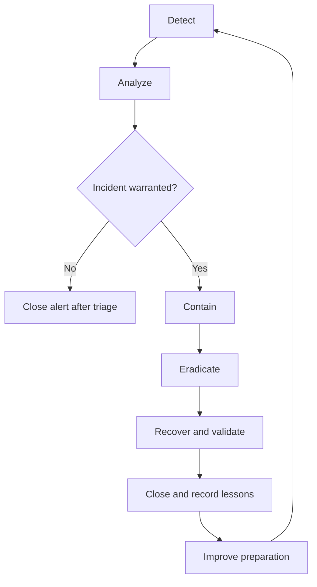

# Incident response flow

Buttons simulate the stages. Review evidence and false positives before creating a case. The application state machine is a simplified educational playbook, not an exact reproduction of a standards framework.
