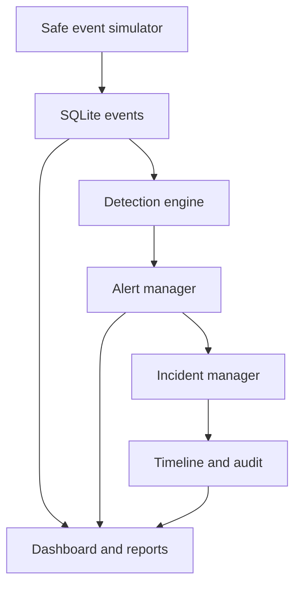

# Monitoring architecture

All components run locally in one Flask application. Event generation and detection share an atomic transaction; each analyst action has its own transaction. No real telemetry or external system integration is present.
